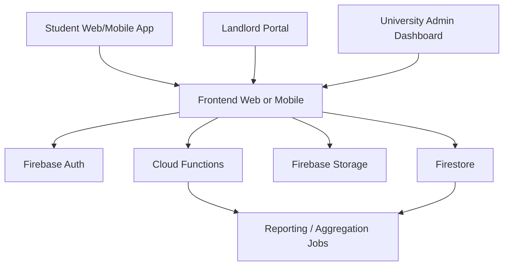

# System Architecture

## Overview
This solution is designed as a university-linked digital platform with separate experiences for students, landlords, and university administrators.

## Components
### 1. Frontend
- Student portal
- Landlord portal
- University admin dashboard

### 2. Backend services
- Authentication
- Listing moderation
- Complaint processing
- Aggregated residential analytics

### 3. Data and storage
- User profiles
- Properties
- Reviews
- Reports
- Area summaries

## Privacy note
The admin dashboard should show aggregated residential data by zone or neighborhood rather than exposing individual student residences publicly.
